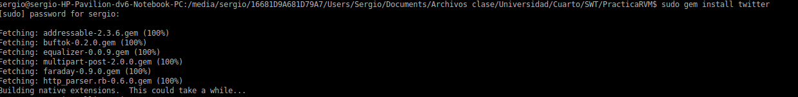

**Sergio Díaz González**

##· Instalación de Git

Para instalar git: 

`sudo apt-get install git`

https://raw.githubusercontent.com/alu3286/SYTW_tareas_iniciales/gh-pages/images/1.png

###· Instalar de RVM

Para instalar RVM necesito tener instalado curl:

`sudo apt-get install curl` 

Y una vez instalada esta herramienta instalo RVM: 

`\curl -#L https://get.rvm.io | bash -s stable --autolibs=3 --ruby`

###· Comprobación que tengo Ruby

Ejecuto el comando siguiente comprobando si tengo ruby y la versión que tengo instalada.

`ruby -v`

								
##Instalación de Bundler

Instalo Bundler:

`sudo gem install bundler`

###· Instalación de Sinatra

Uso el siguiente comando:

`sudo gem install sinatra`

###· Instalación de Twitter

Uso el siguiente comando: 

`sudo gem install twitter`

